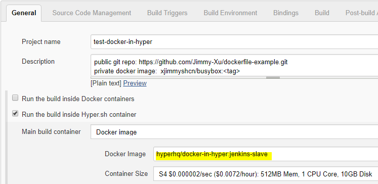
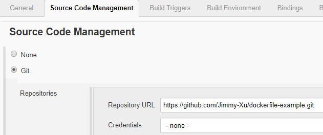
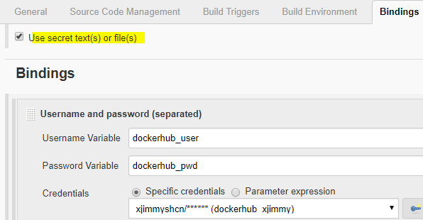
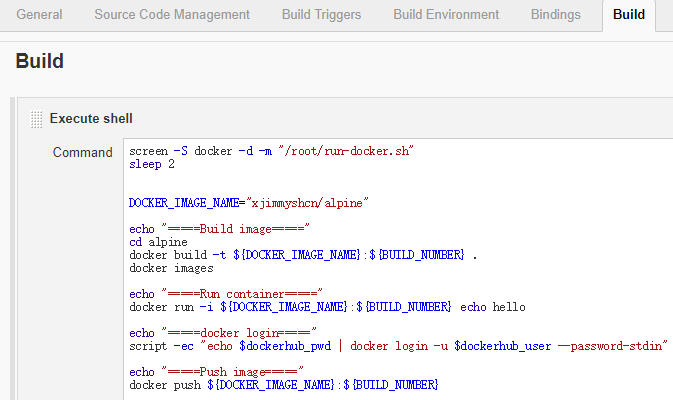

hyperhq/docker-in-hyper:jenkins-slave
=====================================

This is a jenkins slave image with docker-in-hyper.  
The base image is `hyperhq/docker-in-hyper:ubuntu16.04-17.09.0` + `jenkinsci/slave:latest`.

It contains:  
- docker-ce 17.09.0
- oracle-jdk8

# Example

The following example shows how to build docker image in [hykins](https://github.com/hyperhq/hykins).

- **public git repo**:  https://github.com/Jimmy-Xu/wikimindmap
- **private docker image**:  `xjimmyshcn/wikimindmap`

## create jenkins job in hykins

New Item  
  -> Freestyle project

## config docker image

General  
  -> Run the build inside Hyper.sh container  
    -> Docker Image: hyperhq/docker-in-hyper:jenkins-slave ([Dockerfile](https://github.com/Jimmy-Xu/jenkins-image-slave/blob/50e03b41306072e17e9d6b70e93f8889a9cea969/jenkins-slave-docker-in-hyper/ubuntu/docker-ce/Dockerfile))




## config git repo




## config docker hub account

*Required jenkins plugin*: [Credentials Binding Plugin](https://wiki.jenkins.io/display/JENKINS/Credentials+Binding+Plugin)

check `Use secret text(s) or file(s)`  
  -> Add `Username and password (separated)`
    -> Add Credentials, input DockerHub `username` and `password`




## config build step



Use the following script as `Execute shell`

```
screen -S docker -d -m "/root/run-docker.sh"
sleep 2


DOCKER_IMAGE_NAME="xjimmyshcn/alpine"

echo "=====Build image====="
cd alpine
docker build -t ${DOCKER_IMAGE_NAME}:${BUILD_NUMBER} .
docker images

echo "=====Run container====="
docker run -i ${DOCKER_IMAGE_NAME}:${BUILD_NUMBER} echo hello

echo "=====docker login====="
script -ec "echo $dockerhub_pwd | docker login -u $dockerhub_user --password-stdin"

echo "=====Push image====="
docker push ${DOCKER_IMAGE_NAME}:${BUILD_NUMBER}

```
